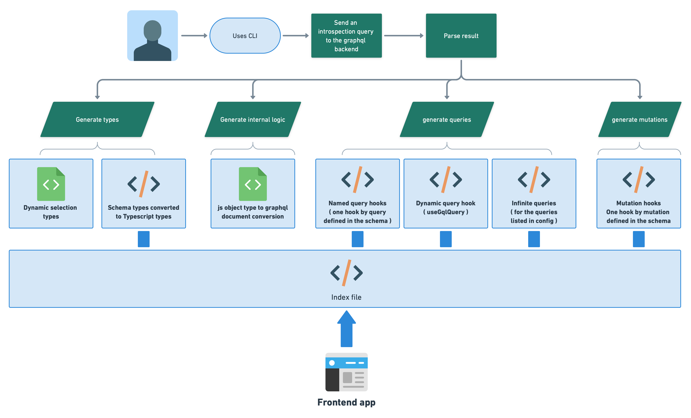

# graphql-codegen-react-query

[](https://github.dev/jpb06/graphql-codegen-react-query)


[](https://sonarcloud.io/summary/new_code?id=jpb06_graphql-codegen-react-query)
[](https://sonarcloud.io/dashboard?id=jpb06_graphql-codegen-react-query)
[](https://sonarcloud.io/dashboard?id=jpb06_graphql-codegen-react-query)
[](https://sonarcloud.io/dashboard?id=jpb06_graphql-codegen-react-query)
[](https://sonarcloud.io/dashboard?id=jpb06_graphql-codegen-react-query)
[](https://sonarcloud.io/summary/new_code?id=jpb06_graphql-codegen-react-query)
[](https://sonarcloud.io/summary/new_code?id=jpb06_graphql-codegen-react-query)
[](https://sonarcloud.io/dashboard?id=jpb06_graphql-codegen-react-query)
[](https://sonarcloud.io/summary/new_code?id=jpb06_graphql-codegen-react-query)
[](https://sonarcloud.io/summary/new_code?id=jpb06_graphql-codegen-react-query)

[](https://sonarcloud.io/dashboard?id=jpb06_graphql-codegen-react-query)


Generating types and react-query hooks from a graphql schema.

<!-- readme-package-icons start -->

<p align="left"><a href="https://docs.github.com/en/actions" target="_blank"></a>&nbsp;<a href="https://www.typescriptlang.org/docs/" target="_blank"></a>&nbsp;<a href="https://nodejs.org/en/docs/" target="_blank"></a>&nbsp;<a href="https://pnpm.io/motivation" target="_blank"></a>&nbsp;<a href="https://axios-http.com/fr/docs/intro" target="_blank"></a>&nbsp;<a href="https://github.com/conventional-changelog" target="_blank"></a>&nbsp;<a href="https://eslint.org/docs/latest/" target="_blank"></a>&nbsp;<a href="https://jestjs.io/docs/getting-started" target="_blank"></a>&nbsp;<a href="https://prettier.io/docs/en/index.html" target="_blank"></a>&nbsp;<a href="https://reactjs.org/docs/getting-started.html" target="_blank"></a>&nbsp;<a href="https://tanstack.com/query/v4/docs/overview" target="_blank"></a>&nbsp;<a href="https://swc.rs/docs/getting-started" target="_blank"></a></p>

<!-- readme-package-icons end -->

## ⚡ Purpose

Graphql codegen is a great tool; zeus-graphql is a neat lib. But they don't exactly fit what I want 😿

> ### 🤔 I want to get clean typescript artifacts from my graphql schema
>
>### 🤔 I want type enforcing for args, params and results while using `useQuery` and `useMutation` hooks
>
>### 🤔 I want to easily import what I need from generated code
>
>### 🤔 When using a query, I want to pick what I want as result when I only need a subset of the query result
>
>### 🤔 But I also want to be able to easily pick everything if that's what I need
>
>### 🤔 I want to define which queries should be translated into infinite queries

So here we go, I just figured I'd do something for giggles 🤷.

## ⚡ What is generated exactly ?



## ⚡ Get started

To install, use either pnpm, yarn or npm:

```bash
yarn add -D graphql-codegen-react-query
```

## ⚡ Usage

### 🔶 Defining a fetcher hook

First of, we need to define a hook that will have the following signature:

```typescript
function useFetcher<TData>(initialQuery: string) => 
  (variables?: unknown, query?: string) => 
    Promise<TData>
```

> 🚨 Make sure you make a named export

Here is an implementation example relying on the `fetch` api:

```typescript
import { endpointUrl } from './fetch-config';

export const useFetchData = <TData>(
  initialQuery: string
): ((variables?: unknown, query?: string) => Promise<TData>) => {
  const [auth] = useAtom(authStateAtom);

  return async (variables?: unknown, query?: string) => {
    const result = await fetch(endpointUrl, {
      method: 'POST',
      headers: {
        'Content-Type': 'application/json',
        // <- injecting custom headers ...
      },
      body: JSON.stringify({
        query: query ? query : initialQuery,
        variables,
      }),
    });

    const json = await result.json();

    if (json.errors) {
      const { message } = json.errors[0] || {};
      throw new Error(message || 'Error…');
    }

    return json.data;
  };
};
```

> 🗯️ But why asking to define a custom fetcher?
>
> You might need to inject config in the fetching logic, like setting an `Authorization` header for example. It's easier done if we externalize > the fetching logic.

### 🔶 Using CLI to get data from a graphql schema url

> 🚨 Make sure introspection is enabled on the backend you target

First step is to create a config file:

```yaml
outputPath: './src/api/codegen'
schemaUrl: 'http://localhost:3333/graphql'
fetcher:
  path: './../useFetchData'
  functionName: 'useFetchData'
infiniteQueries:
  - productsByPage
```

Then generating types from a graphql schema is easy enough using cli. Usage is as follows:

```text
gqlCodegen -c [configFilePath]

Options:
      --help     Show help                                             [boolean]
      --version  Show version number                                   [boolean]
  -c             Codegen config file path
                               [required] [default: "./react-query.codeden.yml"]

Examples:
  gqlCodegen -c ./libs/graphql/react-query.codeden.yml
```

With that in mind, we can add a script to our `package.json`:

```json
{
  [...],
  "scripts:" {
    "codegen": "gqlCodegen -c ./libs/graphql/react-query.codeden.yml",
    [...]
  }
}
```

In this example:

- we will extract information from a graphql schema exposed on `http://localhost:3333`.
- we will be using a hook named `useFetchData` exported from `./src/api/useFetchData.ts`.
- Generated code will be saved in `./src/api/codegen`.
- We will generate an infinite query for the `productsByPage` query.

## ⚡ Features

### 🔶 Clean types

From a schema like this...

```graphql
enum GqlOrderedItemStatus {
  preparing
  readyToBeSent
  shippingInProgress
  shipped
}
type GqlOrderedItem {
  id: ID!
  quantity: Int!
  name: String!
  image: String
  price: Float!
  status: GqlOrderedItemStatus!
}
type GqlOrder {
  id: ID!
  idUser: ID!
  idCreditCard: ID!
  createdAt: DateTime!
  creditCardNumber: String!
  items: [GqlOrderedItem!]!
}
```

I expect to get this:

```typescript
export type GqlOrderedItemStatus = 'preparing' | 'readyToBeSent' | 'shippingInProgress' | 'shipped'

export interface GqlOrderedItem {
  id: string;
  quantity: number;
  name: string;
  image?: string;
  price: number;
  status: GqlOrderedItemStatus
}
export interface GqlOrder {
  id: string;
  idUser: string;
  idCreditCard: string;
  createdAt: Date;
  creditCardNumber: string;
  items: Array<GqlOrderedItem>;
}
```

### 🔶 Dynamic selection and result type inference

> It would be great if I could use named query hooks (one react hook by graphql query) but still be able to select what I want in the result 🤔

For example, for a schema like this, I should have a named query hook `useCategoriesQuery` with type inference:

```graphql
type GqlProduct {
  id: ID!
  idCategory: ID!
  name: String!
  description: String!
  image: String!
  price: Float!
  stock: Int!
}

type GqlCategoryWithProducts {
  id: ID!
  name: String!
  products: [GqlProduct!]
}


type Query {
  categories: [GqlCategoryWithProducts!]!
}
```


If i want the entire query result, I can use `useCategoriesQuery` instead of `useCategoriesPartialQuery`:


### 🔶 Dynamic queries

It would be neat if I could get the results from several graphql queries by calling one single react hook 🤔

Let's use the `useGqlQuery` hook that does just that:


### 🔶 Queries/Mutations variables type support

I would be nice if I had strong typings for arguments and results 🤔


### 🔶 Queries/Mutations options

It would be awesome if I could still easily tweak react query hooks 🤔


