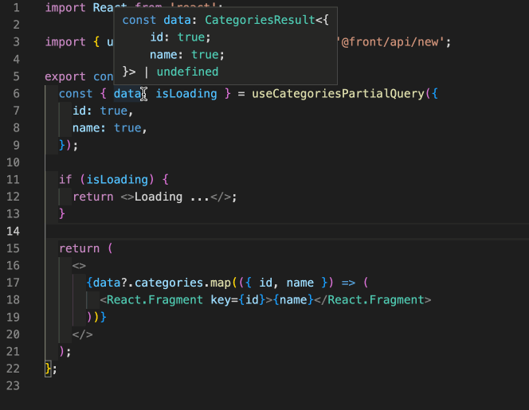

# graphql-codegen-react-query

[](https://github.dev/jpb06/graphql-codegen-react-query)


[](https://sonarcloud.io/summary/new_code?id=jpb06_graphql-codegen-react-query)
[](https://sonarcloud.io/dashboard?id=jpb06_graphql-codegen-react-query)
[](https://sonarcloud.io/dashboard?id=jpb06_graphql-codegen-react-query)
[](https://sonarcloud.io/dashboard?id=jpb06_graphql-codegen-react-query)
[](https://sonarcloud.io/dashboard?id=jpb06_graphql-codegen-react-query)
[](https://sonarcloud.io/summary/new_code?id=jpb06_graphql-codegen-react-query)
[](https://sonarcloud.io/summary/new_code?id=jpb06_graphql-codegen-react-query)
[](https://sonarcloud.io/dashboard?id=jpb06_graphql-codegen-react-query)
[](https://sonarcloud.io/summary/new_code?id=jpb06_graphql-codegen-react-query)
[](https://sonarcloud.io/summary/new_code?id=jpb06_graphql-codegen-react-query)

[](https://sonarcloud.io/dashboard?id=jpb06_graphql-codegen-react-query)


Generating types and react-query hooks from a graphql schema.

<!-- readme-package-icons start -->

<p align="left"><a href="https://docs.github.com/en/actions" target="_blank"></a>&nbsp;<a href="https://www.typescriptlang.org/docs/" target="_blank"></a>&nbsp;<a href="https://nodejs.org/en/docs/" target="_blank"></a>&nbsp;<a href="https://pnpm.io/motivation" target="_blank"></a>&nbsp;<a href="https://axios-http.com/fr/docs/intro" target="_blank"></a>&nbsp;<a href="https://github.com/conventional-changelog" target="_blank"></a>&nbsp;<a href="https://eslint.org/docs/latest/" target="_blank"></a>&nbsp;<a href="https://jestjs.io/docs/getting-started" target="_blank"></a>&nbsp;<a href="https://prettier.io/docs/en/index.html" target="_blank"></a>&nbsp;<a href="https://reactjs.org/docs/getting-started.html" target="_blank"></a>&nbsp;<a href="https://tanstack.com/query/v4/docs/overview" target="_blank"></a>&nbsp;<a href="https://swc.rs/docs/getting-started" target="_blank"></a></p>

<!-- readme-package-icons end -->

## ⚡ Purpose

Graphql codegen is a great tool; zeus-graphql is a neat lib. But they don't exactly fit what I want 😿. I want something like zeus (being able to dynamically perform selection on result), I want to get clean types from schema, I want clean generated code, I want imports that make sense 😼.

So here we go, I just figured I'd do something for giggles.

## ⚡ Expectations

### 🔶 Clean types

From a schema like this...

```graphql
enum GqlOrderedItemStatus {
  preparing
  readyToBeSent
  shippingInProgress
  shipped
}
type GqlOrderedItem {
  id: ID!
  quantity: Int!
  name: String!
  image: String
  price: Float!
  status: GqlOrderedItemStatus!
}
type GqlOrder {
  id: ID!
  idUser: ID!
  idCreditCard: ID!
  createdAt: DateTime!
  creditCardNumber: String!
  items: [GqlOrderedItem!]!
}
```

I expect to get this:

```typescript
export type GqlOrderedItemStatus = 'preparing' | 'readyToBeSent' | 'shippingInProgress' | 'shipped'

export interface GqlOrderedItem {
  id: string;
  quantity: number;
  name: string;
  image?: string;
  price: number;
  status: GqlOrderedItemStatus
}
export interface GqlOrder {
  id: string;
  idUser: string;
  idCreditCard: string;
  createdAt: Date;
  creditCardNumber: string;
  items: Array<GqlOrderedItem>;
}
```

### 🔶 Dynamic selection and result type inference

I want to be able to pick exactly what I need as result for a query. For example, for a schema like this, I should have a named query hook with type inference:

```graphql
type GqlProduct {
  id: ID!
  idCategory: ID!
  name: String!
  description: String!
  image: String!
  price: Float!
  stock: Int!
}

type GqlCategoryWithProducts {
  id: ID!
  name: String!
  products: [GqlProduct!]
}


type Query {
  categories: [GqlCategoryWithProducts!]!
}
```



### 🔶 Dynamic queries

I want to be able to get the results from several queries by calling only one query hook:


### 🔶 Queries/Mutations variables type support

I want to get strong types for mutations args and result:


### 🔶 Queries/Mutations options

I want to be able to pass options to react-query hooks:


## ⚡ Get started

To install, use either pnpm, yarn or npm:

```bash
yarn add -D graphql-codegen-react-query
```

## ⚡ cli

### 🔶 From a graphql schema url

Generating types from a graphql schema is easy enough using cli. Usage is as follows:

```text
generate-from-url -s [schemaUrl] -f [fetcherHookPath] -o [outputPath]

Options:
  -s             Graphql schema url                                   [required]
  -o             Generated code output path                           [required]
  -f             Fetcher hook path and name (<path>#<hookName>)       [required]

Examples:
  generate-from-url -s http://localhost:3333/graphql -o ./src/api -f ./useFetcher#useFetcher
```

With that in mind, we can add a script to our package.json:

```json
{
  [...],
  "scripts:" {
    "cli": "generate-from-url -s http://localhost:3333/graphql -f ./../useFetchData#useFetchData -o ./src/api/specs",
    [...]
  }
}
```

In this example:

- we will extract information from a graphql schema exposed on `http://localhost:3333`.
- we will be using a hook named `useFetchData` exported in `./src/api/useFetchData.ts`.
- Generated code will be saved in `./src/api/specs`.

## ⚡ Generated files

### 🔶 Logic / Util code - `./logic/*`

### 🔶 Types - `./types/api-types.ts`

### 🔶 Hooks - `./queries/*` & `./mutations/*`
